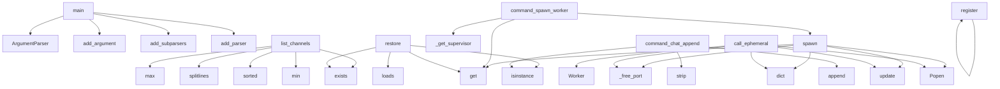

# System Architecture Analysis
<!-- generated in 0.00s -->

## Overview

- **Project**: /home/tom/github/tellmesh/urisys-node
- **Primary Language**: python
- **Languages**: python: 30, yaml: 15, json: 7, shell: 5, yml: 1
- **Analysis Mode**: static
- **Total Functions**: 201
- **Total Classes**: 5
- **Modules**: 61
- **Entry Points**: 52

## Architecture by Module

### urisysnode.supervisor
- **Functions**: 22
- **Classes**: 2
- **File**: `supervisor.py`

### urisysnode.remote
- **Functions**: 21
- **File**: `remote.py`

### urisysnode.artifact_resolver
- **Functions**: 21
- **Classes**: 1
- **File**: `artifact_resolver.py`

### urisysnode.pack_resolver
- **Functions**: 17
- **File**: `pack_resolver.py`

### urisysnode.serve
- **Functions**: 12
- **Classes**: 1
- **File**: `serve.py`

### urisysnode.handlers
- **Functions**: 12
- **File**: `handlers.py`

### urisysnode.identity.health
- **Functions**: 11
- **File**: `health.py`

### urisysnode.display_bootstrap
- **Functions**: 7
- **File**: `display_bootstrap.py`

### urisysnode.port.manager
- **Functions**: 7
- **File**: `manager.py`

### urisysnode.identity.core
- **Functions**: 7
- **File**: `core.py`

### urisysnode.runtime.packs
- **Functions**: 7
- **File**: `packs.py`

### urisysnode.forward_config
- **Functions**: 6
- **File**: `forward_config.py`

### urisysnode.worker
- **Functions**: 6
- **File**: `worker.py`

### urisysnode.port.utils
- **Functions**: 6
- **File**: `utils.py`

### urisysnode.identity.pairing
- **Functions**: 6
- **File**: `pairing.py`

### urisysnode.release_verify
- **Functions**: 5
- **File**: `release_verify.py`

### urisysnode.router
- **Functions**: 5
- **File**: `router.py`

### urisysnode.app_data
- **Functions**: 5
- **Classes**: 1
- **File**: `app_data.py`

### urisysnode.app_handlers
- **Functions**: 4
- **File**: `app_handlers.py`

### urisysnode.runtime.builder
- **Functions**: 4
- **File**: `builder.py`

## Key Entry Points

Main execution flows into the system:

### urisysnode.cli.main
- **Calls**: argparse.ArgumentParser, p.add_argument, p.add_argument, p.add_subparsers, sub.add_parser, s.add_argument, s.add_argument, s.add_argument

### urisysnode.remote.main
- **Calls**: argparse.ArgumentParser, p.add_subparsers, sub.add_parser, h.add_argument, sub.add_parser, w.add_argument, w.add_argument, sub.add_parser

### urisysnode.app_data.AppChatStore.list_channels
- **Calls**: max, None.splitlines, sorted, self.path.exists, min, row.get, by_id.values, int

### urisysnode.supervisor.PackSupervisor.spawn
- **Calls**: self.workers.get, urisysnode.supervisor._free_port, dict, proc_env.update, subprocess.Popen, Worker, self._wait_health, self._wire

### urisysnode.handlers.command_spawn_worker
- **Calls**: urisysnode.handlers._get_supervisor, payload.get, payload.get, sup.spawn, context.get, None.strip, None.strip, isinstance

### urisysnode.supervisor.PackSupervisor.restore
- **Calls**: self.state_path.exists, json.loads, isinstance, rec.get, rec.get, Worker, worker.alive, self.state_path.read_text

### urisysnode.supervisor.PackSupervisor.call_ephemeral
> Run a single URI call in a throwaway worker process, then tear it down.

Unlike :meth:`spawn`, this never registers the worker, never wires forward
ro
- **Calls**: urisysnode.supervisor._free_port, dict, proc_env.update, subprocess.Popen, Worker, str, cmd.append, self._default_worker_env

### urisysnode.app_handlers.command_chat_append
- **Calls**: None.strip, None.strip, None.append, None.strip, isinstance, payload.get, str, str

### urisysnode.routes.register
- **Calls**: rt.register, rt.register, rt.register, rt.register, rt.register, rt.register, rt.register, rt.register

### urisysnode.supervisor.PackSupervisor._default_worker_env
> Propagate node profile + display session vars into pack worker subprocesses.
- **Calls**: None.expanduser, config_path.is_file, os.environ.get, os.environ.get, getattr, str, env.setdefault, os.environ.get

### urisysnode.worker.main
- **Calls**: argparse.ArgumentParser, p.add_argument, p.add_argument, p.add_argument, p.add_argument, p.add_argument, p.add_argument, p.add_argument

### urisysnode.handlers.command_install_pack
- **Calls**: None.strip, context.get, payload.get, urisysnode.runtime.packs.load_pack_into_runtime, context.get, isinstance, str, str

### urisysnode.handlers.command_register_forward
- **Calls**: context.get, None.strip, None.strip, payload.get, urisysnode.serve.register_forward_pack, context.get, isinstance, str

### urisysnode.app_data.AppChatStore.list_messages
- **Calls**: max, None.splitlines, min, self.path.exists, int, self.path.read_text, line.strip, json.loads

### urisysnode.app_handlers.query_chat_messages
- **Calls**: None.strip, int, None.list_messages, len, str, payload.get, urisysnode.app_handlers._store, payload.get

### urisysnode.forward.forward_call
- **Calls**: str, targets.get, None.get, urisysnode.client.remote_call, context.get, uri.split, context.get, type

### urisysnode.pack_resolver.ensure_boot_pack
> Install screen/shell only — uricontrol is already a urisys-node dependency.
- **Calls**: urisysnode.pack_resolver.github_wheel_url, PACK_PYPI.get, urisysnode.pack_resolver._pip_install, attempts.append, out.get, urisysnode.pack_resolver._pip_install, attempts.append, urisysnode.pack_resolver.auto_install_enabled

### urisysnode.port.utils._pids_serve_cmdline
> PIDs whose cmdline looks like ``urisys node serve`` / ``urisys-node serve`` on ``port``.
- **Calls**: str, None.iterdir, int, None.lower, pids.append, Path, entry.name.isdigit, urisysnode.port.utils._read_cmdline

### urisysnode.handlers.query_identity
- **Calls**: urisysnode.identity.core.load_identity, urisysnode.identity.pairing.load_pairing, identity.get, identity.get, bool, pairing.get, pairing.get, pairing.get

### urisysnode.app_data.AppChatStore.append
- **Calls**: str, None.isoformat, self.path.open, f.write, uuid.uuid4, datetime.now, json.dumps

### urisysnode.handlers.query_packs
- **Calls**: context.get, sorted, sorted, urisysnode.pack_resolver.auto_install_enabled, getattr, PACK_MODULES.keys, set

### urisysnode.handlers.command_restart_worker
- **Calls**: urisysnode.handlers._get_supervisor, None.strip, sup.restart, context.get, str, payload.get, payload.get

### urisysnode.handlers.command_stop_worker
- **Calls**: urisysnode.handlers._get_supervisor, None.strip, sup.stop, context.get, str, payload.get, payload.get

### urisysnode.supervisor.PackSupervisor.start_monitor
- **Calls**: self._monitor_stop.clear, threading.Thread, self._monitor.start, self._monitor.is_alive, self._monitor_stop.wait, self._reap

### urisysnode.app_handlers.query_chat_channels
- **Calls**: int, None.list_channels, len, payload.get, urisysnode.app_handlers._store

### urisysnode.supervisor.PackSupervisor._reap
- **Calls**: list, self.workers.items, worker.alive, self.spawn, self._needs_install

### urisysnode.supervisor.PackSupervisor._wait_health
- **Calls**: time.time, time.time, urisysnode.supervisor._http_get, worker.proc.poll, time.sleep

### urisysnode.supervisor.PackSupervisor._wire
- **Calls**: None.items, urisysnode.serve.register_forward_pack, worker.schemes.append, results.append, urisysnode.supervisor._schemes_of

### urisysnode.supervisor.PackSupervisor._persist
- **Calls**: self.state_path.parent.mkdir, self.state_path.write_text, w.to_record, json.dumps, self.workers.values

### urisysnode.pack_resolver.github_wheel_urls
> Pip install specs (uricontrol + wheels) for shell:// bootstrap flows.
- **Calls**: urisysnode.pack_resolver.resolve_pack_spec, urisysnode.pack_resolver.resolve_pack_spec, specs.append, specs.append

## Process Flows

Key execution flows identified:

### Flow 1: main
```
main [urisysnode.cli]
```

### Flow 2: list_channels
```
list_channels [urisysnode.app_data.AppChatStore]
```

### Flow 3: spawn
```
spawn [urisysnode.supervisor.PackSupervisor]
  └─ →> _free_port
```

### Flow 4: command_spawn_worker
```
command_spawn_worker [urisysnode.handlers]
  └─> _get_supervisor
      └─ →> get_supervisor
```

### Flow 5: restore
```
restore [urisysnode.supervisor.PackSupervisor]
```

### Flow 6: call_ephemeral
```
call_ephemeral [urisysnode.supervisor.PackSupervisor]
  └─ →> _free_port
```

### Flow 7: command_chat_append
```
command_chat_append [urisysnode.app_handlers]
```

### Flow 8: register
```
register [urisysnode.routes]
```

### Flow 9: _default_worker_env
```
_default_worker_env [urisysnode.supervisor.PackSupervisor]
```

### Flow 10: command_install_pack
```
command_install_pack [urisysnode.handlers]
  └─ →> load_pack_into_runtime
```

## Key Classes

### urisysnode.supervisor.PackSupervisor
- **Methods**: 17
- **Key Methods**: urisysnode.supervisor.PackSupervisor.__init__, urisysnode.supervisor.PackSupervisor._default_worker_env, urisysnode.supervisor.PackSupervisor.spawn, urisysnode.supervisor.PackSupervisor.call_ephemeral, urisysnode.supervisor.PackSupervisor.restart, urisysnode.supervisor.PackSupervisor._needs_install, urisysnode.supervisor.PackSupervisor.stop, urisysnode.supervisor.PackSupervisor.status, urisysnode.supervisor.PackSupervisor.shutdown, urisysnode.supervisor.PackSupervisor.start_monitor

### urisysnode.app_data.AppChatStore
- **Methods**: 4
- **Key Methods**: urisysnode.app_data.AppChatStore.__init__, urisysnode.app_data.AppChatStore.append, urisysnode.app_data.AppChatStore.list_messages, urisysnode.app_data.AppChatStore.list_channels

### urisysnode.artifact_resolver._GitHubHeaderAuth
- **Methods**: 2
- **Key Methods**: urisysnode.artifact_resolver._GitHubHeaderAuth.__init__, urisysnode.artifact_resolver._GitHubHeaderAuth.https_request
- **Inherits**: urllib.request.BaseHandler

### urisysnode.supervisor.Worker
- **Methods**: 2
- **Key Methods**: urisysnode.supervisor.Worker.alive, urisysnode.supervisor.Worker.to_record

### urisysnode.serve._ReuseHTTPServer
- **Methods**: 0
- **Inherits**: ThreadingHTTPServer

## Data Transformation Functions

Key functions that process and transform data:

### urisysnode.artifact_resolver.parse_contract_spec
> Return {scheme, patterns} from a UriContract markpact. Patterns are every
declared query + command p
- **Output to**: urisysnode.artifact_resolver._contract_yaml_block, None.strip, block.strip, ValueError, yaml.safe_load

### urisysnode.port.manager._is_node_serve_process
> True if ``pid`` is the urisys node HTTP listener (not a shell one-liner).
- **Output to**: urisysnode.port.utils._read_cmdline, cmd.lower, argv0.endswith, low.split, str

## Public API Surface

Functions exposed as public API (no underscore prefix):

- `urisysnode.cli.main` - 116 calls
- `urisysnode.remote.main` - 112 calls
- `urisysnode.serve.make_handler` - 88 calls
- `urisysnode.serve.serve` - 43 calls
- `urisysnode.runtime.builder.build_runtime` - 37 calls
- `urisysnode.serve.call_uri` - 31 calls
- `urisysnode.runtime.packs.load_pack_into_runtime` - 31 calls
- `urisysnode.remote.upgrade_lenovo_node` - 23 calls
- `urisysnode.app_data.AppChatStore.list_channels` - 22 calls
- `urisysnode.supervisor.PackSupervisor.spawn` - 21 calls
- `urisysnode.handlers.command_spawn_worker` - 21 calls
- `urisysnode.forward_config.load_forward_entries` - 20 calls
- `urisysnode.runtime.config.resolve_node_config` - 20 calls
- `urisysnode.supervisor.PackSupervisor.restore` - 20 calls
- `urisysnode.remote.upgrade_lenovo_kv` - 19 calls
- `urisysnode.artifact_resolver.run_release` - 19 calls
- `urisysnode.display_bootstrap.bootstrap_wayland_capture` - 17 calls
- `urisysnode.serve.hotload_release_pack` - 17 calls
- `urisysnode.supervisor.PackSupervisor.call_ephemeral` - 16 calls
- `urisysnode.release_verify.verify_release` - 15 calls
- `urisysnode.client.discover_mdns` - 15 calls
- `urisysnode.artifact_resolver.parse_contract_spec` - 15 calls
- `urisysnode.app_handlers.command_chat_append` - 15 calls
- `urisysnode.identity.core.load_identity` - 15 calls
- `urisysnode.routes.register` - 14 calls
- `urisysnode.client.call_via_route_map` - 14 calls
- `urisysnode.artifact_resolver.select_artifact` - 14 calls
- `urisysnode.runtime.packs.ensure_isolated_pack` - 14 calls
- `urisysnode.release_verify.load_trusted_keys` - 13 calls
- `urisysnode.worker.build_worker_runtime` - 13 calls
- `urisysnode.worker.main` - 13 calls
- `urisysnode.handlers.command_install_pack` - 13 calls
- `urisysnode.forward_config.load_release_forward_entries` - 12 calls
- `urisysnode.artifact_resolver.resolve_and_run` - 12 calls
- `urisysnode.port.manager.takeover_port` - 12 calls
- `urisysnode.identity.health.health_payload` - 12 calls
- `urisysnode.handlers.command_register_forward` - 12 calls
- `urisysnode.remote.build_wheel` - 11 calls
- `urisysnode.artifact_resolver.fetch_release` - 11 calls
- `urisysnode.worker.serve_worker` - 11 calls

## System Interactions

How components interact:



## Reverse Engineering Guidelines

1. **Entry Points**: Start analysis from the entry points listed above
2. **Core Logic**: Focus on classes with many methods
3. **Data Flow**: Follow data transformation functions
4. **Process Flows**: Use the flow diagrams for execution paths
5. **API Surface**: Public API functions reveal the interface

## Context for LLM

Maintain the identified architectural patterns and public API surface when suggesting changes.